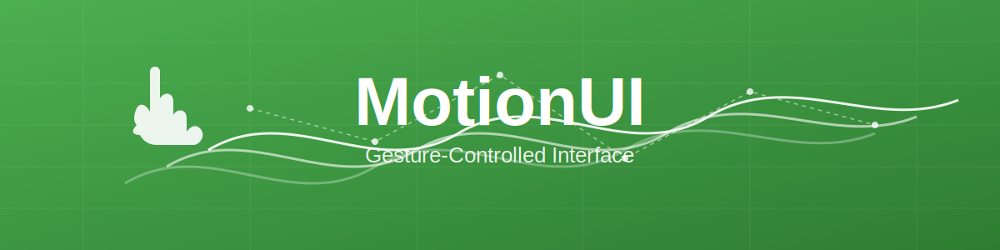

# ✨ MotionUI ✨

> *Where your hands become magic wands in the digital realm*



## 👋 Wave Hello to the Future of Web Interaction

**MotionUI** is not just another website—it's a portal to a world where clicks are relics of the past, and your natural hand movements orchestrate your digital experience. Built with the mystical powers of MediaPipe and the enchantment of TensorFlow.js, MotionUI transforms your ordinary webcam into a gateway of gesture-controlled wonder.

## 🪄 Magic at Your Fingertips (Literally!)

Remember when people thought touchscreens were revolutionary? How quaint! With MotionUI, the air itself becomes your canvas. Point, swipe, scroll, and click—all without touching a single pixel of your screen.

### ✨ Gesture Spellbook

| Gesture | Incantation | What Magic Happens |
|---------|-------------|-------------------|
| 👆 | **The Pointer** | Extend your index finger, curl others. Your digital familiar (cursor) follows faithfully. |
| ✊ | **The Summoner** | Form a fist to click. Elements respond to your commanding presence. |
| 🖐️↕️ | **The Levitator** | Open palm, move up/down. Content scrolls as if bound to your will. |
| 🖐️↔️ | **The Portal Opener** | Swipe left/right with open hand. Travel between realm pages with ease. |

## 🌟 Features That Would Make Any Techno-Wizard Jealous

- **Hands-Free Navigation**: Explore without the burden of physical touch
- **Real-Time Hand Tracking**: Your hand's skeleton revealed in glowing green lines
- **Gesture Recognition**: The site understands your intentions like a loyal familiar
- **Virtual Cursor**: A mystical red orb that obeys your index finger's command
- **Smooth Transitions**: Pages fade in and out like changing seasons
- **Keyboard Fallbacks**: For when you must disguise your magical abilities

## 🧙‍♂️ Getting Started: Your Initiation Ritual

1. **Clone the Repository of Knowledge**
   ```bash
   git clone https://github.com/malavikaswapna/motion-ui.git
   ```
2. **Enter the Sacred Directory**
   ```bash
   cd motionui
   ```

3. **Open the Portal (Locally)**
   Simply open the `index.html` file in your browser of choice

4. **Deploy Your Magic to the Clouds**
   Share your wizardry with the world via Netlify:
   - Create a GitHub repository and push your enchanted code
   - Connect Netlify to your repository
   - Watch as your magic spreads across the digital realm

## 🔮 Requirements for Magical Practice

- A modern browser (Chrome, Firefox, Edge, Safari)
- A webcam (the eye through which your gestures are perceived)
- Adequate lighting (magic doesn't work well in complete darkness)
- A hand (preferably your own, though borrowed hands work in a pinch)
- A sense of wonder and willingness to look slightly silly waving at your computer

## 🌈 The Arcane Tech Stack

- **HTML5**: The parchment upon which our spells are written
- **CSS3**: The ink that gives our magic visual form
- **JavaScript**: The language of incantations
- **MediaPipe Hands**: The ancient art of hand landmark detection
- **TensorFlow.js**: The underlying currents of machine learning power

## 🎭 Perfect Use Cases

- Presentations where touching the computer would break your flow
- Cooking with messy hands but needing to check that recipe
- Public kiosks where germ transmission is a concern
- Showing off to friends and colleagues who are easily impressed
- Pretending you're in Minority Report while checking your email

## 🚫 Less-Than-Ideal Use Cases

- During video calls where wild hand gestures might be misinterpreted
- When your cat is determined to be the center of attention
- In very small spaces where enthusiastic swipes might knock things over
- While attempting to eat soup

## 📜 The Fine Print

This project was created for demonstration and educational purposes. The hand tracking technology, while magical, is not perfect and may occasionally misinterpret your gestures. We take no responsibility for accidental navigation when you were just reaching for your coffee cup.

## 🌟 Contribute to the Magical Community

Feel free to fork this repository, enhance the spells, and submit your pull requests. The magical community thrives on shared knowledge!

## 🧪 Future Enchantments (Coming Soon)

- Multi-hand gestures for advanced wizardry
- Voice command integration for true hands-free sorcery
- Custom gesture training for personal magical styles
- Dark mode for nighttime incantations
- Integration with smart home devices for real-world magic

---

<p align="center">
  <i>Created with ✨ and a wave of the hand by Mala</i><br>
  <i>"The future is motion-shaped"</i>
</p>
   
